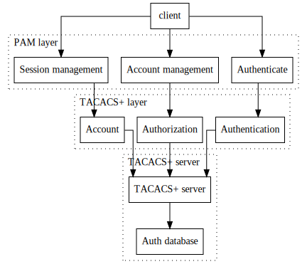

[](https://travis-ci.org/kravietz/pam_tacplus)
[](https://github.com/kravietz/pam_tacplus/network)
[](https://raw.githubusercontent.com/jeroennijhof/pam_tacplus/master/COPYING)
[](https://lgtm.com/projects/g/jeroennijhof/pam_tacplus/alerts/)
[](https://scan.coverity.com/projects/kravietz-pam_tacplus)
[](https://builds.sr.ht/~kravietz/pam-tacplus?)

**Funding:** If you are a commercial user of `pam_tacplus` please consider sponsoring the project through [LiberaPay](https://liberapay.com/webcookies).
This code base has been live since late 90's and requires a significant effort to keep up with modern environments.


# TACACS+ client toolkit

This repository contains three modules that are typically used to perform requests to a TACACS+ server:

* `libtac` - core TACACS+ client library
* `pam_tacplus` - [PAM](https://en.wikipedia.org/wiki/Pluggable_authentication_module) module for authenticating users against TACACS+
* `tacc` - a simple command-line TACACS+ client

The following core TACACS+ functions are supported:

| TACACS+ name   |           PAM name | What it does                        |
|----------------|--------------------|-------------------------------------|
| Authentication | Authenticate       | Is the user who they claim?         |
| Authorization  | Account management | Is the user entitled to service X?  |
| Account        | Session open/close | Record beginning and end of service |

The [TACACS+](https://tools.ietf.org/html/draft-ietf-opsawg-tacacs-15) protocol was designed by Cisco Systems back in 90's
and was intended to provide simple means of validating users connecting to simple network routers (e.g. over PPP) against
a central authentication server. The router can send queries about authentication (validate user credentials), authorization
(entitlement for requested service) and accounting (marking the start and end of user's session). The server can respond
with either simple yes/no response, or send back attributes, such as text of a password prompt, effectively instructing
the router to present it to the user and send back the obtained password.

Unlike RADIUS, which was designed for similar purposes, the TACACS+ protocol offers basic packet encryption but,
as with most crypto designed back then, it's [not secure](http://www.openwall.com/articles/TACACS+-Protocol-Security)
and definitely should not be used over untrusted networks.

This package has been successfully used with free [tac_plus](http://www.shrubbery.net/tac_plus/) TACACS+ server
on variety of operating systems.

### Recognized options:

| Option             | Management group | Description |
|------------------- | ---------------- | ----------- |
| `debug` | ALL | output debugging information via syslog(3); note, that the debugging is heavy, including passwords! |
| `secret` | ALL | *string* can be specified more than once; secret key used to encrypt/decrypt packets sent/received from the server |
| `server` | auth, session | *string* hostname, IP or hostname:port, can be specified more than once |
| `timeout` | ALL | *integer* connection timeout in seconds; default is 5 seconds |
| `login` | auth | TACACS+ authentication service, this can be *pap*, *chap* or *login*; default is *pap* |
| `prompt` | auth | *string* custom password prompt; use `_` instead of spaces  |
| `acct_all` | session | if multiple servers are supplied, pam\_tacplus will send accounting start/stop packets to all servers on the list |
| `service` | account, session | *string* TACACS+ service for authorization and accounting |
| `protocol` | account, session | *string* TACACS+ protocol for authorization and accounting |

Semantics of these options only makes sense in the context of the
[TACACS+ specification](https://tools.ietf.org/html/draft-grant-tacacs-02) &mdash; for example,
a dial-up router might request `ppp` service with protocol `ip` for their users, authenticating
them with `pap` protocol which reflects the typical usage of TACACS+ back in 90's.
These values however do not really need to match the actual service offered by your server
as the TACACS+ server only cares about the service and protocol fields matching what it has
in its configuration.

### Basic installation:
The module is available on most Linux distibutions:
```
# apt install libpam-tacplus
```
To compile from source, the code uses standard GNU `autotools`:
```
$ sudo apt install libpam-tacplus autoconf build-essential libtool automake libpam-dev libssl-dev
$ autoreconf -i
$ ./configure && make && sudo make install
```
You can use `./configure --libdir=/lib` option to ensure `pam_tacplus.so`
 is installed into `/lib/security` along with rather than in `/usr/local`.
 In such case you need to adjust the below lines in `/etc/pam.d` file accordingly.

### Quick start
Install TACACS+ server `tacacs+` and PAM testing program [pamtester](http://pamtester.sourceforge.net/):
```
apt install tacacs+ pamtester
```
Create `/etc/pam.d/test` with the following contents:
```
#%PAM-1.0
auth       required /usr/local/lib/security/pam_tacplus.so server=127.0.0.1 secret=testkey123
account	   required /usr/local/lib/security/pam_tacplus.so server=127.0.0.1 secret=testkey123 service=ppp protocol=ip
session    required /usr/local/lib/security/pam_tacplus.so server=127.0.0.1 secret=testkey123 server=127.0.0.2 secret=testkey123 service=ppp protocol=ip
```
Ensure `/etc/tacacs+/tac_plus.conf` contains the following options:
```
key = testkey123
user = testuser1 {
        global = cleartext "testpass123"
        service = ppp protocol = ip {
                addr=1.2.3.4
        }
}
user = testuser2 {
        global = cleartext "testpass123"
        service = ppp protocol = ip {
                addr=2.3.4.5
        }
}
```
As explained above, the `service` and `protocol` parameters could be really anything,
they however need to match whatever is set in TACACS+ server configuration. 
The TACACS+ protocol transport encryptio key must be however the same on both TACACS+ (`key=`) and
PAM (`secret=`) sides. 

Note the
above example uses absolutely trivial "authentication database" in the form of
statically configured usernames and plaintext passwords. TACACS+ servers can do much
more than that in real life. 

Next, ensure the TACACS+ server is not running system-wide (`systemctl stop tacacs_plus.service`) and run it as `root` in foreground in debugging mode:
```
# tac_plus -C tac_plus.conf -G -g -d 512
Reading config
Version F4.0.4.27a Initialized 1
tac_plus server F4.0.4.27a starting
socket FD 4 AF 2
socket FD 5 AF 10
uid=0 euid=0 gid=0 egid=0 s=911824672
```
In another terminal run the `pamtester` command:
```
# pamtester -v -I rhost=localhost test testuser1 authenticate acct_mgmt open_session close_session
pamtester: invoking pam_start(test, testuser1, ...)
pamtester: performing operation - authenticate
Password: (enter testpass123)
pamtester: successfully authenticated
pamtester: performing operation - open_session
pamtester: successfully opened a session
pamtester: performing operation - close_session
pamtester: session has successfully been closed.
```
System logs (`journalctl -e`) will show debugging output from the `pam_tacplus` module:
```
Oct 04 18:24:05 sweet-jaguarundi PAM-tacplus[4530]: 2 servers defined
Oct 04 18:24:05 sweet-jaguarundi PAM-tacplus[4530]: server[0] { addr=127.0.0.1:49, key='testke
Oct 04 18:24:05 sweet-jaguarundi PAM-tacplus[4530]: server[1] { addr=127.0.0.2:49, key='testke
Oct 04 18:24:05 sweet-jaguarundi PAM-tacplus[4530]: tac_service='ppp'
Oct 04 18:24:05 sweet-jaguarundi PAM-tacplus[4530]: tac_protocol='ip'
Oct 04 18:24:05 sweet-jaguarundi PAM-tacplus[4530]: tac_prompt=''
Oct 04 18:24:05 sweet-jaguarundi PAM-tacplus[4530]: tac_login=''
Oct 04 18:24:05 sweet-jaguarundi pamtester[4530]: _pam_account: [stop] called (pam_tacplus v1.
Oct 04 18:24:05 sweet-jaguarundi pamtester[4530]: _pam_account: tac_srv_no=2
Oct 04 18:24:05 sweet-jaguarundi pamtester[4530]: _pam_account: username [testuser2] obtained
Oct 04 18:24:05 sweet-jaguarundi pamtester[4530]: _pam_account: tty [pts/0] obtained
Oct 04 18:24:05 sweet-jaguarundi pamtester[4530]: _pam_account: rhost [localhost] obtained
Oct 04 18:24:05 sweet-jaguarundi tac_plus[4526]: connect from 127.0.0.1 [127.0.0.1]
Oct 04 18:24:05 sweet-jaguarundi pamtester[4530]: _pam_account: connected with fd=4 (srv 0)
Oct 04 18:24:05 sweet-jaguarundi pamtester[4530]: _pam_account: [stop] for [testuser2] sent
```
TACACS+ server confirms successful authentication:
```
connect from 127.0.0.1 [127.0.0.1]
pap-login query for 'testuser1' port pts/0 from 127.0.0.1 accepted
```
This confirms correct operations of the core functions of TACACS+ &mdash; authentication and accounting.

Now, if you change the `secret` set in `/etc/pam.d/test` to say `testkey999`, you will get the following errors
from `pam_tacplus` module:
```
Oct 04 18:31:48 sweet-jaguarundi tac_plus[4526]: Error 127.0.0.1 pts/0: Invalid AUTHEN/START packet (check keys)
Oct 04 18:31:48 sweet-jaguarundi pamtester[4896]: tac_authen_read: inconsistent reply body, incorrect key?
```
And accordingly from `tac_plus` server:
```
connect from 127.0.0.1 [127.0.0.1]
127.0.0.1 pts/0: Invalid AUTHEN/START packet (check keys)
```
Note that _semantics_ of these operation is outside of the scope of this quick guide and is very much service
dependent.

### More on server lists:

1. Having more that one TACACS+ server defined for given management group
has following effects on authentication:

 	* if the first server on the list is unreachable or failing
	  pam\_tacplus will try to authenticate the user against the other
	  servers until it succeeds

	* the `first_hit` option has been deprecated

	* when the authentication function gets a positive reply from
	  a server, it saves its address for future use by account
	  management function (see below)

2. The account management (authorization) function asks *only one*
TACACS+ server and it ignores the whole server list passed from command
line. It uses server saved by authentication function after successful
authenticating user on that server. We assume that the server is
authoritative for queries about that user.

3. The session management (accounting) functions obtain their server lists
independently from the other functions. This allows you to account user
sessions on different servers than those used for authentication and
authorization.

	* normally, without the `acct_all` modifier, the extra servers
	  on the list will be considered as backup servers, mostly like
	  in point 1. i.e. they will be used only if the first server
	  on the list will fail to accept our accounting packets.

	* with `acct_all` pam_tacplus will try to deliver the accounting
	  packets to all servers on the list; failure of one of the servers
	  will make it try another one. This is useful when your have several accounting, billing or
	  logging hosts and want to have the accounting information appear
	  on all of them at the same time.


### Short introduction to PAM via TACACS+:

This diagram should show general idea of how the whole process looks:



Consider `login' application:

1. Login accepts username and password from the user.
2. Login calls PAM function `pam_authenticate()` to verify if the
   supplied username/password pair is valid.
3. PAM loads `pam_tacplus` module (as defined in `/etc/pam.d/login`)
   and calls `pam_sm_authenticate()` function supplied by this module.
4. This function sends an encrypted packet to the TACACS+ server.
   The packet contains username and password to verify. TACACS+ server
   replied with either positive or negative response. If the reponse
   is negative, the whole thing is over
5. PAM calls another function from `pam_tacplus` &mdash; `pam_sm_acct_mgmt()`.
   This function is expected to verify whether the users are allowed
   to get the service they are requesting (in this case: unix shell).
   The function again verifies the permission on TACACS+ server. Assume
   the server granted the user with requested service.
6. Before user gets the shell, PAM calls one another function from
   `pam_tacplus` &mdash; `pam_sm_open_session()`. This results in sending an
   accounting START packet to the server. Among other things it contains
   the terminal user loggen in on and the time session started.
7. When user logs out, `pam_sm_close_session()` sends STOP packet to the
   server. The whole session is closed.

### TACACS+ client program

The library comes with a simple TACACS+ client program `tacc` which can be used for testing as well as simple scripting. Sample usage:

```
tacc --authenticate --authorize --account --username user1
    --password pass1 --server localhost --remote 1.1.1.1 --tty ttyS0
    --secret enckey1 --service ppp --protocol ip --login pap
```
This configuration runs full AAA round (authentication, authorization and accounting). The `server` and `secret` option specify server connection parameters and all remaining options supply data specific to TACACS+ protocol. The `tac_plus` daemon (found in `tacacs+` package in Debian and Ubuntu) can be used for testing with the following example configuration:
```
key = enckey1
user = user1 {
    global = cleartext "pass1"
    service = ppp protocol = ip {
            addr=8.8.8.8
    }
}
```

For debugging run the `tac_plus` server with the following options - the `-d 512` will debug encryption, for other values see `man 8 tac_plus`:

```
tac_plus -C /etc/tacacs+/tac_plus.conf -G -g -d 512
```

### Limitations:

* only subset of TACACS+ protocol is supported; it's enough for most need, though
* `tacc` does not support password prompts and other interactive protocol features
		
### Authors:

Pawel Krawczyk <pawel.krawczyk@hush.com>
https://ipsec.pl/

Jeroen Nijhof <jeroen@jeroennijhof.nl>
